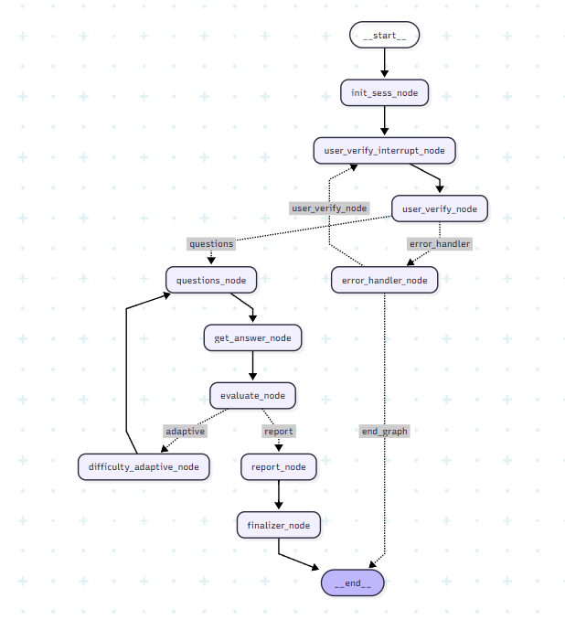

# 📊 AI-Powered Excel Interview Bot

            

An AI-driven Excel interview platform built with **LangGraph, FastAPI, and Streamlit**, designed to simulate a real-world adaptive interview. The system verifies candidates, asks dynamic Excel questions, evaluates responses, adapts difficulty, generates structured reports, and saves results into MongoDB for HR review.  

---

## 🎯 Why This Project?  

Hiring managers often struggle with **scalable and fair Excel skill assessments**. Manual interviews:  
- Take time ⏳  
- Are subjective 🤔  
- Don’t scale across candidates 👥  

This project solves the problem by building an **autonomous AI-powered interviewer** that is:  
- 🔄 **Adaptive** → difficulty adjusts based on candidate performance.  
- 📝 **Structured** → every question, answer, evaluation, and score is logged.  
- 📊 **Insightful** → generates reports with strengths, weaknesses, and pass/fail decision.  
- ⚡ **Production-Ready** → integrates directly with HR systems.  

---

## 🚀 Features

- 🔑 **User Verification** (Email/Employee ID with retry & error handling)  
- ❓ **Dynamic Questioning** (topic-based Excel interview questions)  
- 🤖 **AI Evaluation** (LLM-based grading out of 10)  
- 📈 **Adaptive Difficulty** (questions get harder/easier based on scores)  
- 📂 **Answer Logging** (all Q/A/Evaluations stored in MongoDB)  
- 📝 **Structured Report Generation** (strengths, weaknesses, final decision)  
- ☁️ **MongoDB Storage** (audit-friendly logs and results for HR)  
- 🖥️ **Streamlit Frontend** (chat-like UI for candidate interaction)  
- ⚡ **FastAPI Backend** (async, modular, and production-ready)  

---

## 🛠️ Tech Stack

- **Backend**: FastAPI + LangGraph  
- **Frontend**: Streamlit (chat-based UI)  
- **Database**: MongoDB (Async)  
- **AI/LLM**: OpenAI GPT-4o-mini for Q/A generation & evaluation  
- **Orchestration**: LangGraph (interrupts, adaptive flow, state management)  

---

## 📂 Project Structure

```
Directory structure:
└── rawatrahul14-excel-interview-bot/
    ├── README.md
    ├── app.py
    ├── main.py
    ├── requirements.txt
    ├── setup.py
    ├── template.py
    └── src/
        └── interviewBot/
            ├── __init__.py
            ├── agent_state.py
            ├── details.py
            ├── graph.py
            ├── Agents/
            │   ├── __init__.py
            │   ├── adaptive.py
            │   ├── answers.py
            │   ├── error.py
            │   ├── evaluate.py
            │   ├── final.py
            │   ├── initSess.py
            │   ├── make_report.py
            │   ├── question_maker.py
            │   └── user_verification.py
            ├── components/
            │   ├── __init__.py
            │   ├── report_upload.py
            │   ├── topic.py
            │   └── verification.py
            ├── data/
            │   └── questions.yaml
            ├── routes/
            │   ├── __init__.py
            │   └── router.py
            ├── Schema/
            │   ├── __init__.py
            │   ├── model_output.py
            │   └── responses.py
            └── utils/
                ├── __init__.py
                ├── common.py
                └── ui_streamer.py
```


---

## ⚡ Installation & Setup

1️⃣ Clone the Repository:
```bash
git clone https://github.com/RawatRahul14/excel-interview-bot.git
cd excel-interview-bot
```

2️⃣ Create Virtual Environment:
```bash
python -m venv .venv
source .venv/bin/activate   # Mac/Linux
.venv\Scripts\activate      # Windows
```

3️⃣ Install Dependencies:
```bash
pip install -r requirements.txt
```

4️⃣ Configure Environment:
Create a .env file in the root folder:
```env
# === MongoDB Connection ===
MONGODB_URI = ""
DB_NAME = ""
COLLECTION_NAME = ""

# === Verification Collection ===
DB_NAME_VERIFICATION = ""
COLLECTION_NAME_VERIFICATION = ""

# === Upload Collection ===
DB_NAME_UPLOAD = ""
COLLECTION_NAME_UPLOAD = ""

# === OpenAI API Key ===
OPENAI_API_KEY = ""
```

5️⃣ Run Backend (FastAPI):
```bash
uvicorn backend.main:app --reload
```

6️⃣ Run Frontend (Streamlit):
```bash
streamlit run app.py
```

## 🖼️ Workflow Diagram

Steps:
- Candidate verification (email/ID)
- Dynamic Excel questions asked
- Candidate responds → evaluated by AI
- Difficulty adapts automatically
- All answers saved to MongoDB
- Structured report generated
- Final decision → Pass / Fail / Needs Review



---

## 📊 Example Output

MongoDB log document:
```json
{
    "user_id": "rahulrawat272chd@gmail.com",
    "timestamp": "2025-09-16T17:09:36.817+00:00",
    "answers_log": [
        {
            "q": "Explain how to use Solver...",
            "ans": "I'd set up profit as objective...",
            "eval": "Good explanation with clear steps",
            "score": 8
        },
        {
            "q": "Differences between VLOOKUP, INDEX-MATCH, XLOOKUP...",
            "ans": "VLOOKUP is simple but limited...",
            "eval": "Good explanation with clear distinctions",
            "score": 8
        }
    ],
    "report": "Candidate has strong understanding...",
    "final_decision": "pass"
}
```